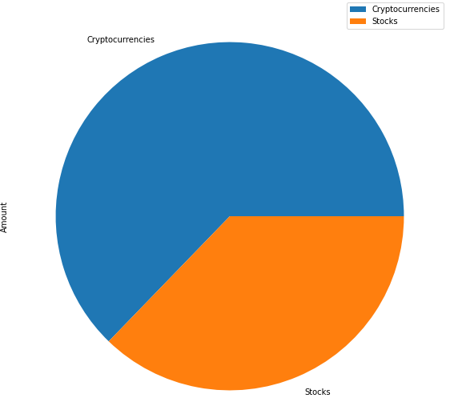
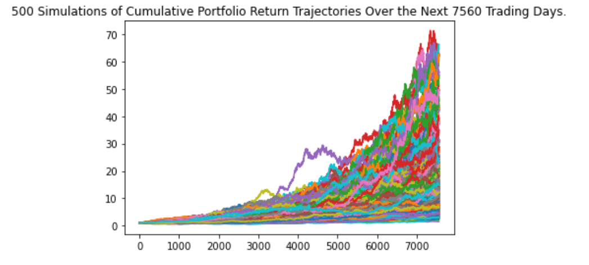
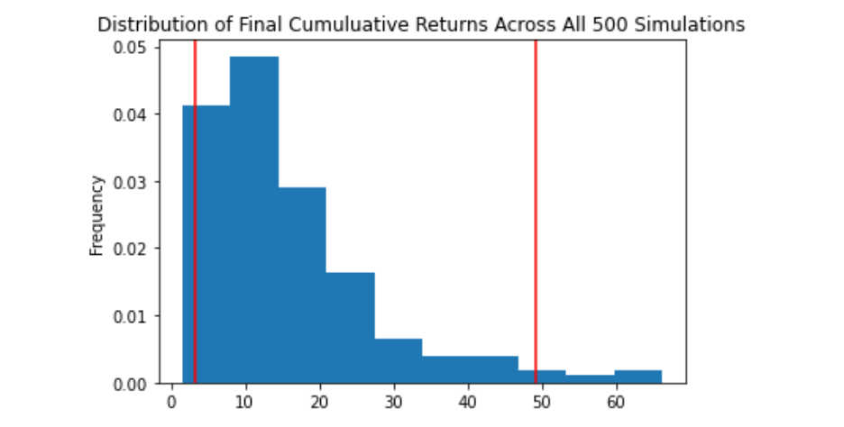
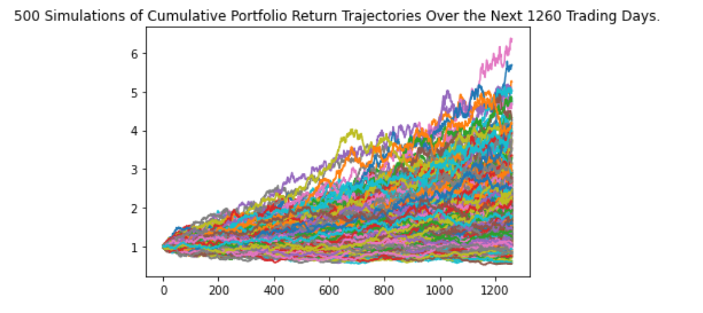
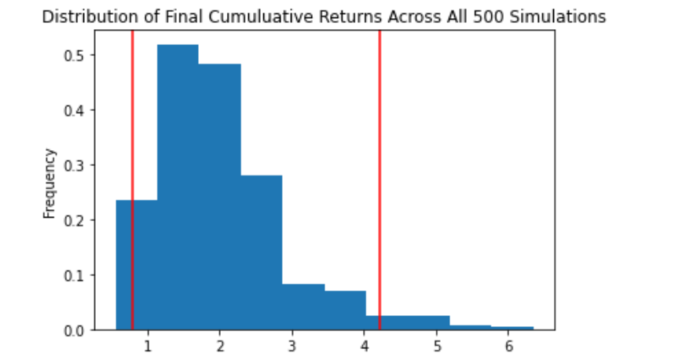
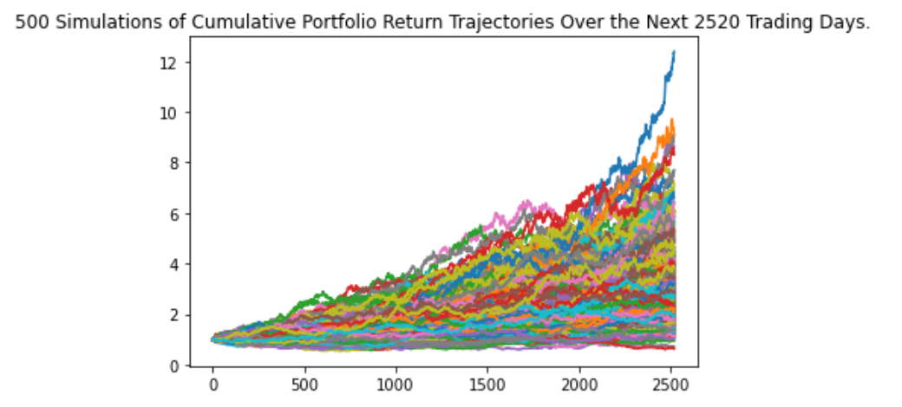
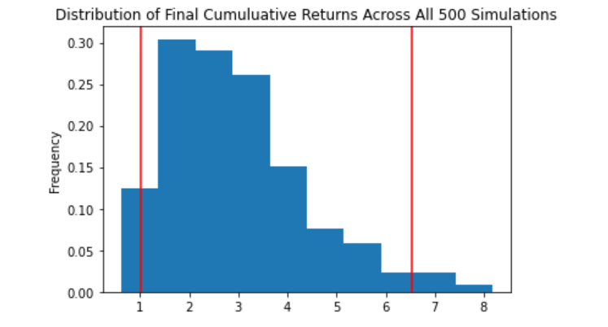

# Financial-Planning

## Part 1 - Personal Finance Planner

#### Under this planner, we are assuming every union member has a savings portfolio comprise of cryptocurrencies (BTC & ETH), stocks (SPY), and bonds(AGG). The analysis further assumes that all members held the same securities and shares held within their portfolios:

######      * 1.2 BTC
######      * 5.3 ETH
######      * 200 AGG
######      * 50 SPY

