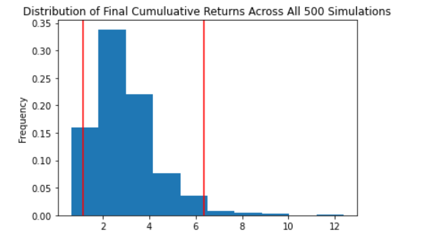

# Financial Planning

## Part 1 - Personal Finance Planner

#### Under this planner, we are assuming every union member has a savings portfolio comprise of cryptocurrencies (BTC & ETH), stocks (SPY), and bonds(AGG). The analysis further assumes that all members held the same securities and shares held within their portfolios with the average housebold income of $12,000 per month. The holdings of each securities can be shown as such:

######      * 1.2 BTC
######      * 5.3 ETH
######      * 200 AGG
######      * 50 SPY

#### On March 24th, 2021, the closing price for the above securities are:

######      * BTC = $52,325.00
######      * ETH = $1,574.90
######      * AGG = $114.17
######      * SPY = $387.55

#### Based on the aforementioned prices, the planner concludes that the current market value of the portfolio is $113,348.58. Below is a breakdown of each security's market value held by each member:

######      * 1.20 BTC holding at $52,325/BTC is $62,790.00
######      * 5.30 ETH holding at $1,574.90/ETH is $8,347.08
######      * Total cryptocurrency holding is equal to $71,137.88 
######      * 200 AGG shares at closing price of $114.17 is $22,834.00 
######      * 50 SPY shares at closing price of $387.55 is $19,377.50
######      * Total stock and bond holding is equal to $ 42,211.50

#### The pie chart below demonstrates each member's aggregateportfolio value:

#### Lastly, we have also adopted the assumption that an ideal emergency fund for each member should be equal to three times of the members' monthly income. Since the average monthly income is calculated at $12,000, we have calculated the emergency fund for each member should be $36,000. If total savings from each member's portfolio is less than the emergency fund of $36,000, we will notify the member on the difference (emergency fund minus savings less than emergency fund) for the member to reach his/her goal.

#### In conclusion per our analysis above, the member have exceeded his/her goal of saving more than three times of their monthly income in their emergency fund. As mentioned above, the total portfolio value is $113,348.58, which is  $77,348.58 above members' goal of reaching $36,000 in emergency fund.

## Part 2 - Retirement Planning

#### The retirement planning model here utilizes Monte Carlo simulation tool to project the portfolio performance at 30 year period. The model assumes 60% of the holdings is comprised of SPY while the remaining 40% holds AGG. The model pulls data from Alpaca API

